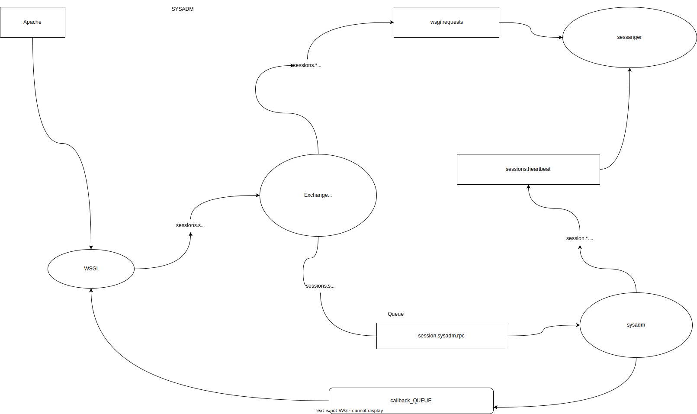
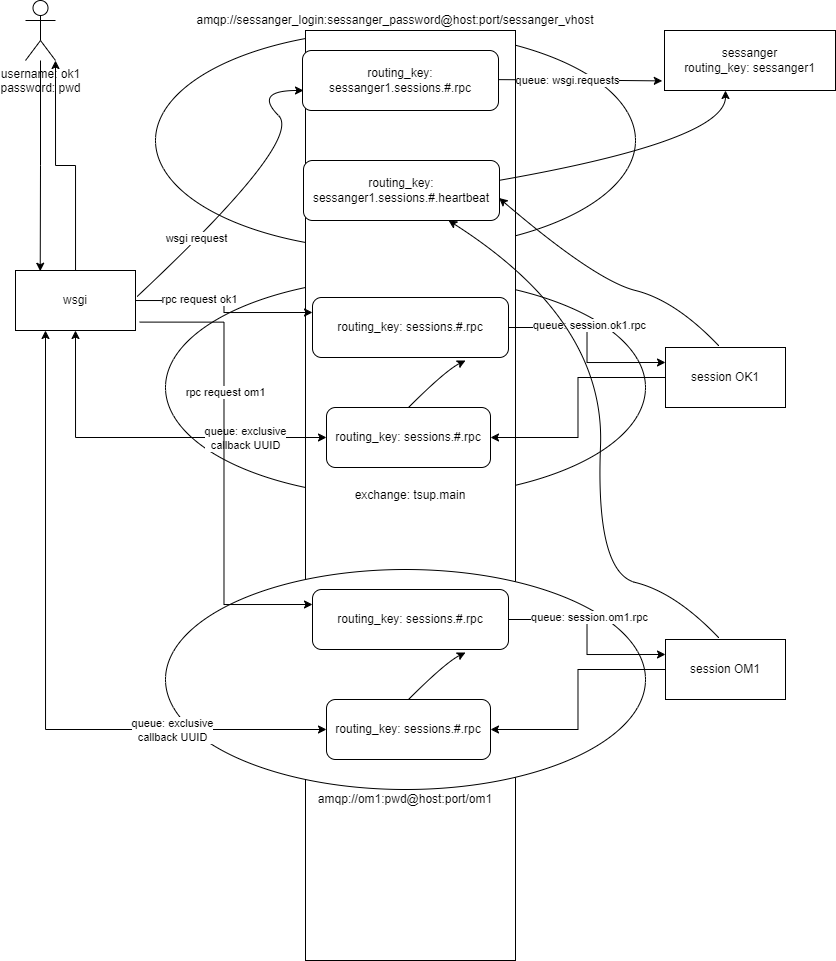

# **Менеджер сессий**

## Принцип работы менеджера сессий



# **Разделение пользователей на несколько менеджеров сессий**



При PAM авторизации каждый пользователь заводится в RabbitMQ с таким же логином и паролем, как при входе в систему

Так же для него заводится свой виртуальный хост с названием, как имя пользователя.

**Пример:**

```
username: sysadm

password: sysadm

vhost: sysadm

```

Для менеджера сессий заводится специальный пользователь в RabbitMQ со своим виртуальным хостом

**Пример:**

```
username: sessanger

password: sessanger

vhost: sessanger
```

В конфигурационном файл для менеджера сессий вводится новый параметр в сессии **routing_key**

```yaml
session:
  ...
 
  # Название routing_key для RabbitMQ
  routing_key: ${BROKER_ROUTING_KEY}
```

Подключение для broker в конфигурационных файлах будет выглядеть следующим образомЖ


```yaml
broker:
  url: ${TSUP_BROKER_URL}
  sessanger:
    login: ${BROKER_SESSANGER_LOGIN}
    password: ${BROKER_SESSANGER_PASSWORD}
  user:
    password: ${BROKER_USER_PASSWORD}
  routing_keys:
    sessanger1: ['*']
```

**Пример 1** для 

```yaml
broker:
    url: 127.0.0.1:5672
    sessanger:
      login: sessanger
      password: sessanger
    user:
      password: 123
    routing_keys:
      sessanger1: ['*']
```
где **login** и **password** это данные для авторизации для менеджера сессий в сервере RabbitMQ

**routing_keys**:
являются списком менеджеров сессий у которых указан в конфиге **routing_key**

Значением в данном случае является ['*'] это говорит о том, что работает только один менеджер сессий и все подключения сессии пользователей стартуют через него

**Пример 2** для

```yaml
broker:
    url: 127.0.0.1:5672
    sessanger:
      login: sessanger
      password: sessanger
    routing_keys:
      sessanger1: [sysadm, ok1]
      sessanger2: [om1]
```
где **login** и **password** это данные для авторизации для менеджера сессий в сервере RabbitMQ

**routing_keys**:
являются списком менеджеров сессий у которых указан в конфиге **routing_key**

Значением в данном случае является **[sysadm, ok1]** это говорит о том, что к менеджеру сессий с **routing_key: sessanger1** будут работать пользователи **sysadm**,
**ok1**

Для второго менеджера сессий с **routing_key: sessanger2** будет работать пользователь **om1**
